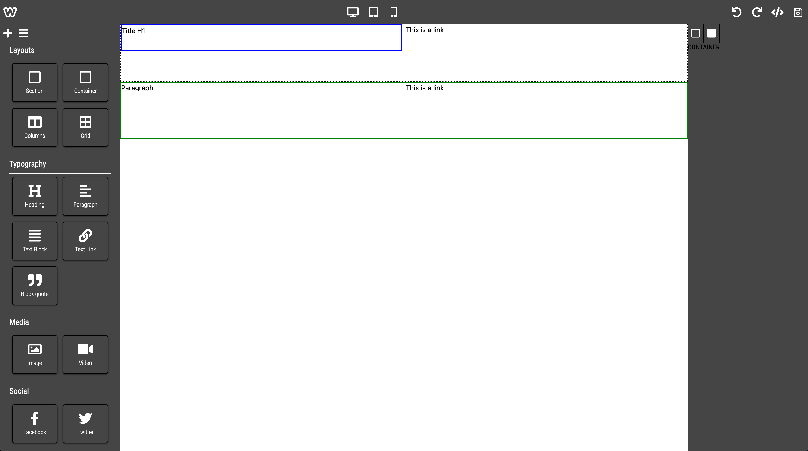

# Wape
Web Application Page Editor  

Work in progress project  
Build website without coding, drag and drop elements and layouts on the page, responsive pages, different devices preview while building, export page as html/css or save content and provide access to it with an hosted api.  
Offers different layouts and html predefined blocks.  
Save portions of the page to re-use it in other pages (personnal block library)  
Edit content, images, links, social buttons, ....  
Add custom blocks and CSS styles  



## Usage
```html
<div id="editor"></div>

<script type="text/javascript">
    new Wape({
        el: "#editor"
    });
</script>
```

## Roadmap
- [X] Use Tailwind in iframe
- [X] Mitt event emmiter to remove $on
- [X] Don't rely on fontawesome cdn but serve it from here
- [X] Do not use templates.js
- [X] Make editor layouts (containers, layouts (DROPPABLE TARGETS))
- [X] Make editor elements (html elements (no forms elements for now))
- [X] Change bulma for utility framework and extend it for the editor use (tailwindcss)
- [X] Make the cloned element visible and with an opacity of .5 place it where it would be dropped if mouse is released
- [X] Make responsive previews
- [ ] Add support for custom CSS in editor (allow adding classes to elements once custom css is loaded in iframe)
- [ ] Make settings customisation for components and elements (html attributes mostly (id / class / ...)) => Depends on component/element
- [ ] Refactor a lot dragger class and especially RenderShadowElement function which is a big mess (+100 lines)
- [ ] Review and maybe change the layouts.js / elements.js organization for clarity
- [ ] Make style customisation for components and elements (css properties like display / borders / bg colors / text color / font size, weight, family / text alignment / line height, letter spacing, margin for blocks / padding for blocks / ...) => Depends on component/element maybe generate a combination of corresponding css classes to add to the element while customizing it (tailwind would be good for this)
- [ ] Undo / Redo action
- [ ] Make structure of the page view (maybe switch to it when dragging something in the page)
- [ ] Make code exporting (full page or body only)
- [ ] Make save options (Option to host final template in a personnal library provided by an API)
- [ ] Ability to save parts of a template (like grouping elements)
- [ ] Learn Jest
